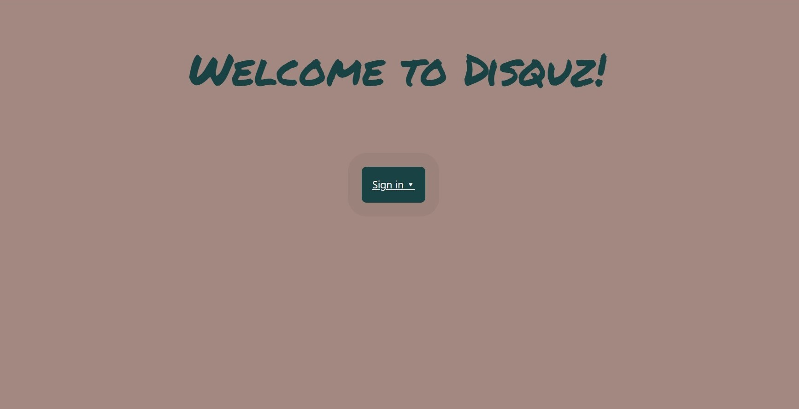
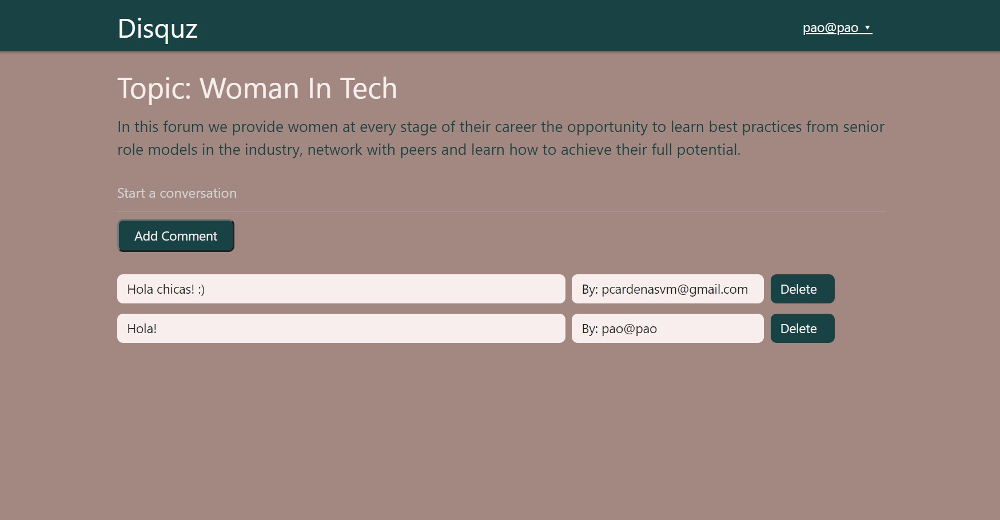

  

<h1 align="center">Disquz</h1>

  <strong>Made by Jenny Cárdenas </strong>
   
   This project was created with Meteor, HTML and CSS.

  
   ‎ ‎ ‎ ‎
  

## 👩🏼‍💻 About Disquz 

It is a dashboard board for any topic, when the users can discuss or start a conversation about it. You must be a registered user and be logged in to go to the dashboard.

## 🔧 Built With

- HTML
- CSS
- Meteor
- Meteor packages

## 🤖 Live Demo

[Disquz](https://disquz.meteorapp.com/)

## 👥 Author

👤 **Jenny Cárdenas**

- GitHub: [@janis_jenny](https://github.com/janis-jenny)
- Twitter: [@janis_jenny](https://twitter.com/janis_jenny)
- LinkedIn: [Jenny Càrdenas](https://www.linkedin.com/in/paolajenny)

## 🤝 Contributing

Contributions, issues, and feature requests are welcome!

Feel free to check the [issues page](https://github.com/janis-jenny/MeteorAssessment/issues).

## ⭐ Show your support

Give a ⭐️ if you like this project!

## 📌 Acknowledgments

- [Meteor Docs](https://docs.meteor.com/#/full/)
- [Meteor Blaze tutorial](https://blaze-tutorial.meteor.com/)
- Stack Overflow

## 📝 License

This project is [MIT](https://opensource.org/licenses/MIT) licensed.

